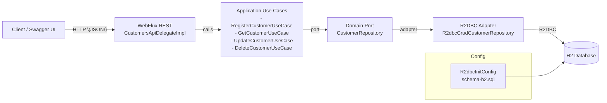

## Customer V1 API

- Java 21, Spring Boot 3 (WebFlux)
- OpenAPI Generator (delegate pattern)
- R2DBC + H2 (sin consola H2 en WebFlux)

### Microservice Diagram 



## Run it (Docker Compose)

- Clonar el repositorio y entrar en la carpeta
  ```powershell
  git clone https://github.com/vito-ivan/customer-v1.git
  cd customer-v1
  ```

- Compilar el proyecto (opcional si vas a construir la imagen; recomendado para verificar que compile)
  ```powershell
  .\mvnw.cmd -DskipTests clean package
  ```

- Construir y levantar
  ```powershell
  docker compose up --build
  ```
- Ver logs y seguir
  ```powershell
  docker compose logs -f --tail=120
  ```
- Parar
  ```powershell
  docker compose down
  ```

## API endpoints

OpenAPI

- Spec: `src/main/resources/openapi/api.yaml`
- UI: http://localhost:8080/webjars/swagger-ui/index.html

Health

- http://localhost:8080/actuator/health


## Try it with curl

Import in postman and prove

```
Customer V1 API.postman_collection.json
```

## Testing

```powershell
.\mvnw.cmd -DskipTests=false test
```
